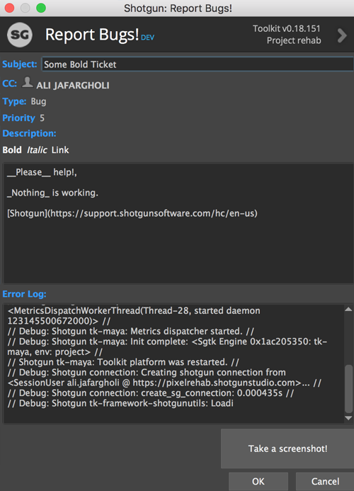

# Bug-Reporter App
A Shotgun app for submit ticket for reporting bugs and request.

This app originally was created by 
[Shotgun Software](https://www.shotgunsoftware.com/), I believe by 
[Jeff Beeland](https://www.linkedin.com/in/jefferybeeland/), and was 
demonstrated in [this video](https://www.youtube.com/watch?v=bT2WlQaJVmY). I
modified it a bit to accommodate my need in our studio.

### Features
* Ability to add the _error_ messages
* Include the environment variable
* Include the current _engine_ and _context_
* Specify Ticket Type _ex: bug or feature_
* Specify the priority
* Whether or not to include the _system environment variables_
* Specify just which environment variable to include in the ticket
* Ability to make the selected text in the ticket description __Bolds__, _Italic_, or Link  

### Icon
The Bug Icon is by youtube.com/AlfredoCreates & Flaticondesign.com from the 
Noun Project
